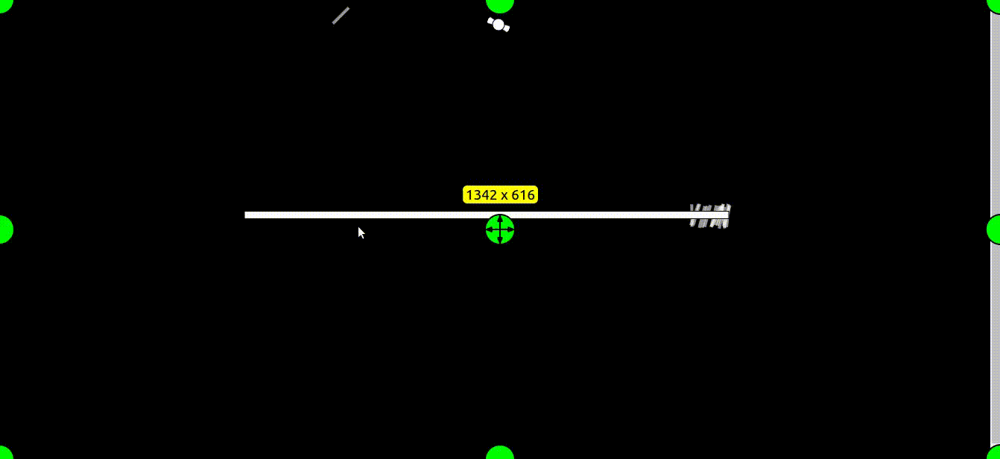

## Genetic Rockets

>The fact that life evolved out of nearly nothing, some 10 billion years after the universe evolved out of literally nothing, is a fact so staggering that I would be mad to attempt words to do it justice.” 
— Richard Dawkins

An implementation of genetic algorithms to a population of spacecrafts to enhance their steering behavior. To view the project click [here](https://samagra14.github.io/genetic_rockets/). Please allow the simulation to run a few times and you will see a distinct steering pattern emerge.

### What are genetic algorithms ?

The genetic algorithm is a method for solving both constrained and unconstrained optimization problems that is based on natural selection, the process that drives biological evolution. The genetic algorithm repeatedly modifies a population of individual solutions. At each step, the genetic algorithm selects individuals at random from the current population to be parents and uses them to produce the children for the next generation. Over successive generations, the population "evolves" toward an optimal solution. You can apply the genetic algorithm to solve a variety of optimization problems that are not well suited for standard optimization algorithms, including problems in which the objective function is discontinuous, nondifferentiable, stochastic, or highly nonlinear. The genetic algorithm can address problems of mixed integer programming, where some components are restricted to be integer-valued.

The genetic algorithm uses three main types of rules at each step to create the next generation from the current population:
* **Selection rules** select the individuals, called parents, that contribute to the population at the next generation.

* **Crossover rules** combine two parents to form children for the next generation.

* **Mutation rules** apply random changes to individual parents to form children.

### Todos

1. Improve design. Add colors and stuff.
2. More interesting mazes and obstacles.
3. Give options for various fitness functions for natural selection. (exponential, linear , polynomial etc.)
4. Involve learning algorithms for function approximation.

### Contributing

Just send a PR.

### Sources

* Daniel Shiffman's [Nature of Code](http://natureofcode.com/book/chapter-9-the-evolution-of-code/)
* Wikipedia's [article](https://en.wikipedia.org/wiki/Genetic_algorithm) on genetic algorithms.
*  Mathworks's [article](https://in.mathworks.com/discovery/genetic-algorithm.html) on genetic algorithms.

This video was inspired entirely from Daniel Shiffman. 
